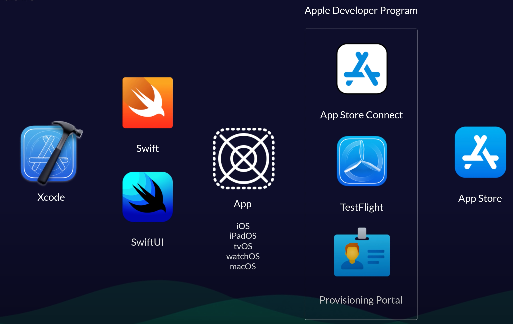
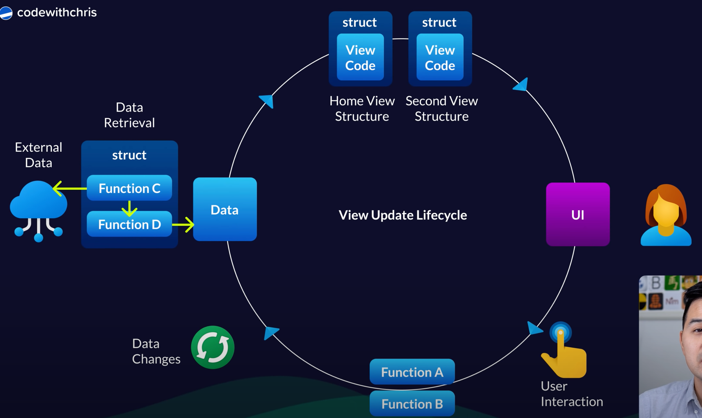
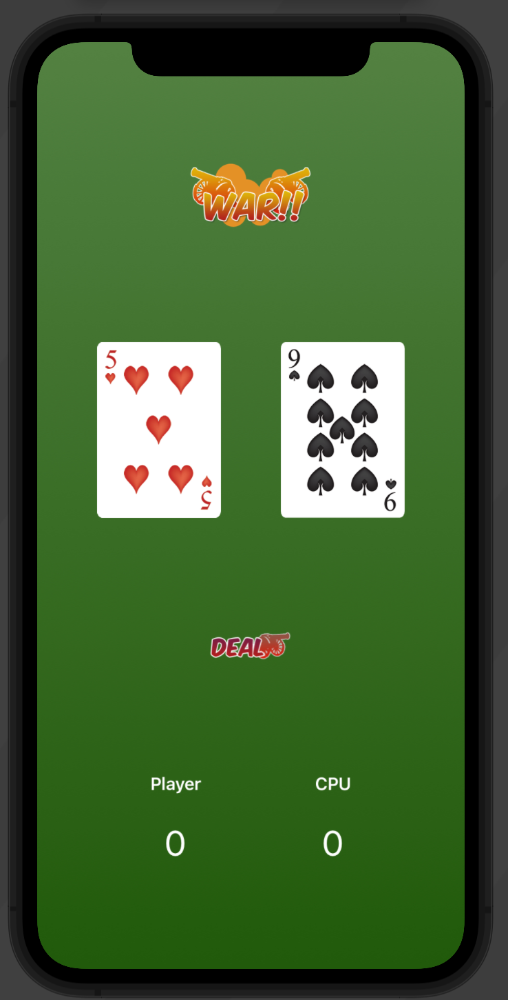

# Try iOS

> - [iOS Tutorial (2020): How To Make Your First App](https://youtu.be/09TeUXjzpKs)
> - ✅ [2021 SwiftUI Tutorial for Beginners (3.5 hour Masterclass)](https://youtu.be/F2ojC6TNwws)



## 키워드

- 뷰&뷰컨트롤러
- Auto Layout: 여러 사이즈의 스크린에 적합하도록 만듬. 뷰에서의 엘리먼트의 사이즈와 포지션을 기술
  - 다른요소에 상대적으로 배치한다.
  - width가 얼마다가 아니라 어떤 뷰(예를들면 컨테이너) 기준으로 위치가 어디다 라고 정의한다.
    (예를들어 컨테이너 기준으로 left: 10, right: 10 이다 정도로 정의할 수 있다. 그럼 어느화면에서나 이렇게 보인다.)

## AutoLayout

- 기본적으로 absolute x, y 좌표계를 이용한다 (x, y, width, height)
- pt 단위를 사용한다. 이는 스크린 resolution에 따라 다르게 적용된다
  - 1pt = 1px @1x (10x10)
  - 1pt = 4px @2x (20x20)
  - 1pt = 9px @3x (30x30)

## 정보

- XCode13 부터는 info.plist 가 기본 제공되지 않는다. project 설정에서 값을 찾을 수 있다.

## View Update Lifecycle



## Swift

### Closure, Trailing Closure

### 익명함수

> 스위프트에서는 `클로저`랑 같은 의미라는데 js는 아니라서 정말 동일한 의미인지 확인해봐야할듯

아래 세가지는 동일한 의미를 갖는다.

```swift
func myFunc(isOn: Bool) -> (){
  // Something...
}

{
  (isOn: Bool) -> () in
  // Something...
}

// 반환타입은 추론이 가능한 경우, 생략가능
{
  (isOn: Bool) in
  // Something...
}
```

### 배열 선언

```swift
var color = [String]()
color.append("빨간색")

var color2: [String] = ["빨간색"]
```

## MVVM


## 특이사항

### delegate

storyboard를 사용하는 경우, 특이하게도 코드로 모든걸 작성하는게 아니라 UI에서 이리저리 링크를 걸게된다. 그 중 "delegate"라는게 있는데, 어떤 뷰의 컨트롤 책임을 넘기는 녀석인듯하다. 예를들어 "picker view"를 사용할 때 ViewController로 delegate를 하면, ViewController에서 UIPickerViewDelegate를 구현하고 이 컨트롤에 대한 책임을 위임한다. (특정 뷰를 우클릭 -> 컨트롤러로 드래그, delegate)

지금까지의 생각으로는 코드로 모든게 관리되지 않아서 iOS 개발은 뭔가 빠뜨리기 쉬운 것같은 느낌이 있다.

## Projects

### War Challenge


